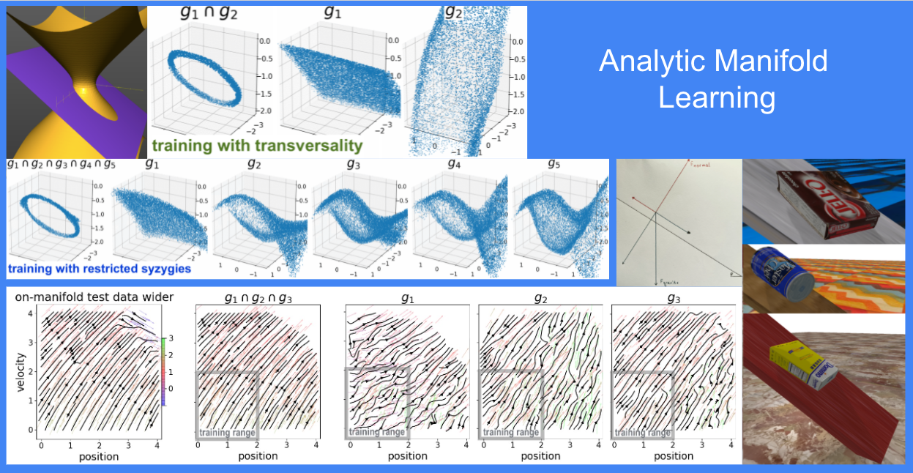

AML is a package for learning independent relations from data. Here independence 
is understood in the sense of not following from each other, and is formalized
mathematically in several ways, see [[1]](#1).
AML can be used in aid of transfer learning as described in [[1]](#1), 
but is general in scope.


**Table of Contents:**<br />

[Overview](#overview)<br />
[Installation](#install)<br />
[Data sources and visualization](#data)<br />
[Examples and TensorBoard output](#tb)<br />
[AML data source classes](#aml)<br />
[Options](#option)<br />
[References](#ref)<br />

<a name="overview"></a>
## AML overview

Given a source of "on-manifold" data, AML trains a tuple of neural nets.  Each of these nets outputs zero value when fed on-manifold data. In this sense, each such net represents a relation which holds on the manifold. As one  example, consider the data of points in the plane. We may take the "on-manifold" data to be those points that lie on the unit circle. For such points, the relation $x^2+y^2-1=0$ will hold. As another example, consider the data consisting of initial and final positions and velocities of a particle. Suppose we take as "on-manifold" data the positions and velocities of particles  moving in Earth's gravity without resistance of drag.   Then, for such on-manifold data, the relation $(gz_0+v_0^2/2)-(gz_1+v_1^2/2)=0$ (expressing the conservation of energy) will hold.

 For points off-manifold, where the relations do not hold, the output can (and most likely will be) be non-zero. 
This makes the outputs of the nets we have learned suitable for use as penalty terms which encourage (some other) data towards satisfying the same relations, i.e. towards lying on the same data manifold. 

The key issue is in how to learn appropriate relations. To continue with our example, having learned $x^2+y^2-1=0$ we don't want to learn, say, $x^3-y^2x-x=0$. The relations we learn should not follow from each other, they should be *independent*. We consider several formalizations of this notion, and use them to guide the learning of independent relations. Please refer to [[1]](#1) for mathematical and algorithmic details.

<a name="install"></a>
## Installation

Optional initial steps: 

1) Create a new conda environment with
`conda create --name aml python=3.9` and activate it with
`conda activate aml`. Conda is not strictly needed; 
alternatives like virtualenv can be used; 
a direct install without using virtual environments is ok as well.

2) On machine with a GPU, to use it for training run  
`conda install pytorch cudatoolkit=11.1 -c pytorch -c nvidia`


Clone this repo (e.g. into `~/code/` directory), then install:
```
cd ~/code/aml
pip install -e .
```


<a name="data"></a>
## Data sources and visualizations

AML can be used with arbitrary data source which generates batches of on-manifold data. The package provides two basic types of sources - parametric curves, and a dynamical systems. These are exemplified by an ellipse in 3D and a block-on-incline dynamics, respectively; please see [AML data source classes](#aml) section for more details.

AML visualizes the learned relations by filtering randomly generated data to select those data points on which the learned relations hold, and plotting such data points in TensorBoard.  AML supports several plotting strategies, controlled by the visualization_type and visualization_data_indexes parameters. One is to simply make a scatter plot of 2 or 3 of the data dimensions (visualization_type '2D scatter' and '3D scatter'). Another is to pick two pairs of dimensions (for example initial position and velocity and final position and velocity) and plot arrows between them (visualization_type '2D forward'). Note that if you were to use a custom data source generating higher-dimensional data, these visualization strategies are likely to prove inadequate, and a custom implementation of .visualize method would likely be needed for the corresponding DataSource class.


<a name="tb"></a>
## AML examples and TensorBoard output

You can start AML by running

```
python -m aml.aml_main
```

Note, however, that by default the visualization_interval is set to None, meaning that no
images are generated. To see visualizations set it to a finite value 
(say, anything between 500 and 50000):

```
python -m aml.aml_main --visualization_interval 5000
```

To use TensorBoard to monitor progress, you can launch it via

```
tensorboard --logdir=/tmp/tmp_aml --bind_all
```

which will give you access to the logged data and images , by default at http://localhost:6006/. 

Opeining this in your browser, you will see summary of the runs on th eleft, indicating the data source classes and the launch time stamps, as well as the logging directory name.
Going to the IMAGES tab you will see visualisations, updated throughout the training. 


In the TEXT tab you can see the arguments used during selected runs (see the [Options](#option) section for more on those), and in the SCALARS various components of loss functions used during training.

By default, AML launches with Ellipse data source, which generates training data lying on an elliptical curve in 3D. Launching with one of the data sources simulating a block on incline, pass the corresponding DataSource class name as a parameter:

```
python -m aml.aml_main --visualization_interval 5000 --data_source ConservativeBlock45Incline1D
```

```
 python -m aml.aml_main --visualization_interval 50000 --max_relations 3 --data_source Block1D
 ```

The visualisation switches to a 'forward map' one:


<a name="aml"></a>
## AML data source class hierarchy

The aml.data_sources package contain a hierarchy of data generating classes. The abstract base class is DataSource. Anything that implements the get_batch method (and has some way of naming the data dimensions for visualization) qualifies.   In particular, we implement two main subclasses. 

First is ParametricCurve. It provides data by generating random times from a domain_segment and evaluating a list of parametric_equations  at those points. Optionally, the  parametric_equations may be vectorized functions acting on numpy arrays; then the data will be generated directly in batches. As an illustration, in the Ellipse subclass, we provide both vectorized and non-vectorized implementations which generates data on an ellipse in 3D.

Secondly, ForwardEvolution is the catch-all class for data sources coming from dynamical systems. The system is represented by the forward_map parameter.

 It has three subclasses, based on wether the forward_map is produced by solving an ODE system numerically (we use scipy.integrate.solve_ivp), given explicitly as a [flow](https://en.wikipedia.org/wiki/Flow_(mathematics)), or simply as a map. There is, again, a vectorization parameter (but note that scipy.integrate.solve_ivp is not vectorized in initial values). 
 
 The ODEsystem and Flow classes are illustrated by BlockOnInclineODE and BlockOnIncline subclasses, respectively. The BlockOnIncline flow is obtained from an explicit closed form solution of the corresponding ODEs, both with drag proportional to velocity or proportional to the square of the velocity, as detailed in the block_on_incline files (the quadratic velocity case is rather entertaining).
 
 Finally, we derive a variety of BlockOnIncline subclasses, with some of the parameters preset to various values, for ease of use.
 
  


<a name="options"></a>
## Options

AML can be run with various command line options. You can see all of them by running

```
python -m aml.aml_main -h
```
or
```
python -m aml.aml_main --help
```

(or by looking in the aml.aml_arguments.py file). 

Some of the more important ones are:

**Data source**:

    --data_source

Choice of the data generating class. The options are 'Ellipse' and multiple BlockOnIncline classes. The default is  'ConservativeBlock45Incline1D'.
                        

**Logging**: 

    --save_path_prefix 
Path for logs and output.

    --load_checkpt 
Directory with checkpoint files.

**CPU/GPU**:

    --device 
Device, e.g. 'cpu' or 'cuda:0'.


**Number of relations and learning mode**
  
    --max_relations 
  
  Maximum number of relations to learn.
  
  
      --max_syzygies 
  
  Maximum number of syzygies to learn, aka how much we try to make the relations independent. If not supplied, AML will use transversality as the independence-inducing mechanism (which does not use syzygies).
  


<a name="ref"></a>
## References

For more information about AML, please refer to:

  <a name="[1]"></a>[1] Rika Antonova, Maksim Maydanskiy, Danica Kragic, Sam Devlin, Katja Hofmann.
  Analytic Manifold Learning: Unifying and Evaluating Representations for Continuous Control,
  [arXiv:2006.08718](https://arxiv.org/abs/2006.08718), 2020
