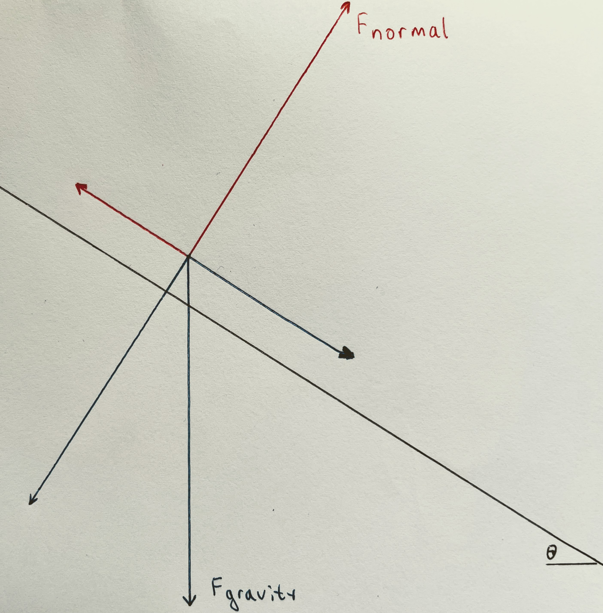
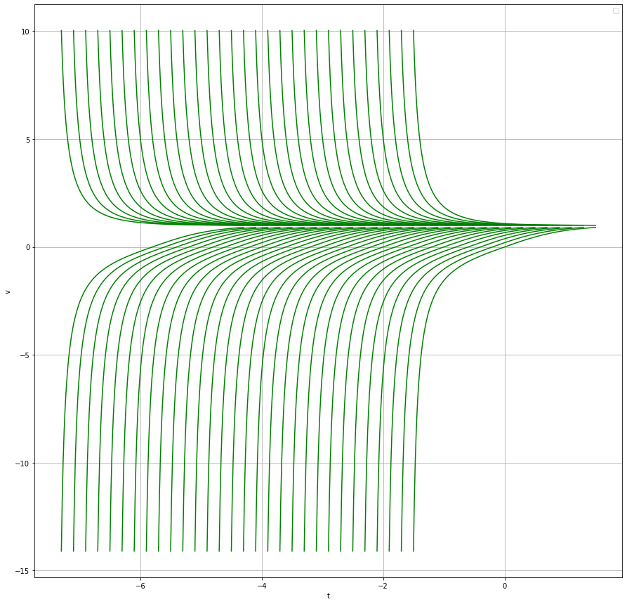

# Block on incline.

We write down and solve the ODE for a block on an (infinite) inclined plane. 

We use distance along the incline as the coordinate $s$, 
oriented downward. This makes all tangential forces, 
accelerations, and velocities into scalars.

{width=400}

$$|a_{\text{gravity}}|=g$$
$$|a_{\text{gravity-tangential}}|=g \sin \theta$$
$$|a_{\text{normal}}|=g \cos \theta$$
$$|a_{\text{friction}}|= \mu g \cos \theta$$

We take  

$$c=g (\sin \theta-\mu\cos \theta).$$

### No drag:

$$s''=c$$
$$s(t)=s(0)+v(0)t+ct^2/2$$

### Proportional drag:

$$a_{\text{drag}}=-r v$$

$$s''=c-r s'$$

$$v'=c-rv$$

Then $v_{\text{terminal}}=\frac{c}{r}$ is the terminal velocity,
and the velocity converges to it exponentially with rate $r$:

$$v(t)=v_{\text{terminal}}+(v(0)-v_{\text{terminal}}) e^{-rt}$$

  Set $v_{\text{terminal}}-v(0)=K$. Then

$$v(t)=v_{\text{terminal}}-Ke^{-rt}$$
And finally:

$$s(t)=s(0)+v_{\text{terminal}}t+\frac{K}{r}(e^{-rt}-1).$$

    
     
### Quadratic drag:

$$a_{\text{drag}}=-r v |v|$$

$$v'=c-r|v| v.$$

#### Special case.

We shall start with $c=r=1$, 

$$v'=1-|v|v.$$

Then the equilibrium velocity is $v|v|=1$ aka $v=1$.

Apart from the trivial case $v(0)=1$, 
there are 3 regimes depending on $v(0)$:
     a) when $v(0)>1$, 
     b) when $0 \leq v(0)<1$,
     c) when $v(0)<0$.

When $v\geq 0$ the ODE is 
$$v'=1-v^2.$$

When  $v(0)=0$  this is the characterizing equation of 
$$v(t)=\tanh t.$$
(This is also a shifted version of the logistic ODE $u'=u(1-u)$ 
whose solution with $u'(0)=1$ is the sigmoid; 
$\tanh$ is the shifted sigmoid.)

The ODE is time-invariant, which means that for those $v(0)$
which are in the range of $\tanh$ (i.e. between -1 and 1), the solution is
$v(t)=\tanh (T+t)$ for (the unique) $T$ such that $\tanh(T)=v(0)$ 
(in our case $v(0)\geq 0$ we have $T\geq 0$ ). That is

$$v(t)=\tanh (T+t)=\frac{\tanh T+ \tanh t}{1+ \tanh T \tanh t}=
\frac{v(0)+ \tanh t}{1+ v(0)\tanh t }$$

Furthermore, the equation $v'=1-v^2$ is invariant under 
$v\leftrightarrow \frac{1}{v}$.
Thus, for $v(0)$ with $v(0)>1$, the solutions are of the form 

$$v(t)=\coth (T+t)=
\frac{1+ \coth T \coth t }{\coth T+ \coth t}=
\frac{1+ v(0)\coth t }{v(0)+ \coth t}$$

This solves the regimes a and b.

When $v\leq 0$, we have 

$$v'=1+v^2$$

which, for $v(0)=0$  is solved by 
$$v(t)=\tan(t)$$
and in general by

$$v(t)=\tan(T+t)=\frac{v(0)+ \tan t}{1 - v(0)\tan t }.$$

In our case $v(0)=\tan T<0$ we have $T\leq 0$.

Note that in this regime the trajectory will reach $v=0$ at $t=-T\geq 0$ 
and will switch to $\tanh(t+T)$ for subsequent $t$. 
They have the same slope of 1, both have zero second derivative, 
and only differ in the third derivative.

The phase portrait for velocity looks like this:

{width=500}

[The colab](https://colab.research.google.com/drive/1Ag4lDgYzqfQO5Px4chp2JgwMTXzyY-GD?usp=sharing)
which  produced this image.

#### General case, velocity. 
     
To get the solutions to 
$$v'=c-rv^2$$
 we need to dilate time and stretch the function.
That is, we are looking for a solution in the form $v(t)=Af(Bt)$ 
where $f'=1-f^2$ or $f^2=1-f'$.
Then $v'=c-rv^2$ translates to

$$ABf'=c-r(A^2f^2)=c-r(A^2(1-f'))$$

$$AB=rA^2, \quad c=rA^2$$

$$A=\sqrt{\frac{c}{r}}, \quad B=\sqrt{cr}.$$

The terminal velocity is now $V=\sqrt{\frac{c}{r}}$, so $A=V$ and $B=rV$. 

##### Non-negative initial velocity.

If $v(0)\geq V$ the solution is 
$$v(t)=V \coth(r V (t+T))=V\frac{V+v(0)\coth(rVt)}{v(0)+V\coth(rVt)}$$
$$=V\frac{\tanh (rV t)+\frac{v(0)}{V}}{\frac{v(0)}{V} \tanh(rVt)+1} $$

Here $T=\frac{1}{rV}\text{arcoth} (\frac{v(0)}{V})>0$.
(There is a singularity in the past, at $t=-T$). 

If $V>v(0)\geq 0$ the solution is 
$$v(t)=V \tanh(r V (t+T))=V\frac{v(0)+V\tanh(rVt)}{V+v(0)\tanh(rVt)}$$
$$=V\frac{\frac{v(0)}{V}+\tanh(rVt)}{1+\frac{v(0)}{V}\tanh(rVt)}.$$

Here $T=\frac{1}{rV}\text{artanh} (\frac{v(0)}{V})>0$.
(The solution has crossed zero in the past, at $t=-T$).

The formulas coincide, and, in fact give $v(t)=V$ when $v(0)=V$.

##### Negative initial velocity.

If $v(0)<0$ then initially the solution is

$$v(t)=V\tan(rV(t+T))=V \frac{v(0)+V\tan(rVt)}{V-v(0)\tan(rVt)}$$
$$=V\frac{\frac{v(0)}{V}+\tan(rVt)}{1-\frac{v(0)}{V}\tan(rVt)}.$$

Here $T=\frac{1}{rV}\arctan (\frac{v(0)}{V})<0$. Then, after $t=-T$:

$$v(t)=V\tanh(rV(t+T))=
V\frac{\tanh(\arctan \frac{v(0)}{V})+\tanh(rVt)}
{1+\tanh(\arctan \frac{v(0)}{V})\tanh(rVt)}.$$

#### General case, position.

The distance travelled is the integral of velocity. 

##### Non-negative initial velocity.

For the case $v(0) \geq V$

$$s(t)-s(0)=\int_0^t v(\tau) \, d\tau=\int_0^t V \coth(r V (\tau+T)) \, d\tau$$

Recalling $rV=B$, $u=B(\tau+T)$ so $du=Bd\tau$.

$$s(t)-s(0)=\frac{1}{r}\int_{BT}^{B(t+T)} \coth u \, du=$$
$$\frac{1}{r} \ln \frac{\sinh B(t+T)}{\sinh BT}=
\frac{1}{r} \ln(\cosh Bt + \sinh Bt\coth BT)=$$
$$=\frac{1}{r} \ln(\cosh rVt + \frac{v(0)}{V}\sinh rVt)$$

Similarly, for the case $V>v(0)\geq 0$

$$s(t)-s(0)=\int_0^t v(\tau) \, d\tau=\int_0^t V \tanh(r V (\tau+T)) \, d\tau$$

Again,  $rV=B$, $u=B(\tau+T)$ so $du=Bd\tau$.

$$s(t)-s(0)=\frac{1}{r}\int_{BT}^{B(t+T)} \tanh u \, du=$$
$$\frac{1}{r} \ln \frac{\cosh B(t+T)}{\cosh BT}=\frac{1}{r} \ln(\cosh Bt + \sinh Bt\tanh BT)$$
$$=\frac{1}{r} \ln(\cosh rVt + \frac{v(0)}{V} \sinh rVt)$$

Note that these formulas coincide. In fact this holds also when $V=v(0)$ where 
it becomes $\frac{1}{r}rVt=Vt$, as expected.

##### Negative initial velocity.

For $v(0)<0$ there are two regimes, 
before switching direction and after. Initially, when $t<-T$ 
(and hence $Bt<\frac{\pi}{2}$)

$$s(t)-s(0)=\int_0^t v(\tau) \, d\tau=\int_0^t V \tan(r V (\tau+T)) \, d\tau$$

$$s(t)-s(0)=\frac{1}{r}\int_{BT}^{B(t+T)} \tan u \, du=$$
$$=-\frac{1}{r} \ln \frac{\cos B(t+T)}{\cos BT}=-\frac{1}{r} \ln(\cos Bt - \sin Bt\tan BT)$$
$$=-\frac{1}{r} \ln(\cos rVt - \frac{v(0)}{V}\sin rVt)$$

Note that at $t=-T$

$$s(-T)-s(0)=\frac{1}{r}\ln(\cos BT)=
\frac{1}{r}\ln (\cos(\arctan\frac{v(0)}{V}))=$$
$$=-\frac{1}{2r}\ln (1+\left(\frac{v(0)}{V}\right)^2).$$

Then, when $t>-T$,

$$s(t)-s(0)=
-\frac{1}{2r}\ln (1+\left(\frac{v(0)}{V}\right)^2)+\frac{1}{r} \ln(\cosh rV(t+T))$$
$$-\frac{1}{2r}\ln (1+\left(\frac{v(0)}{V}\right)^2)
+\frac{1}{r} \ln(\cosh (rVt+\arctan \frac{v(0)}{V})).$$
